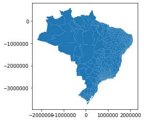
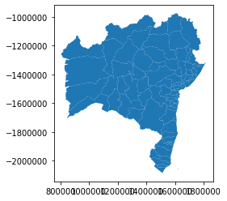
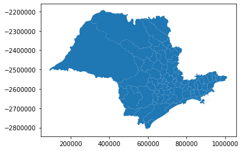
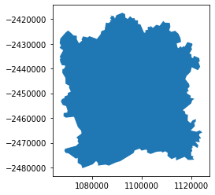
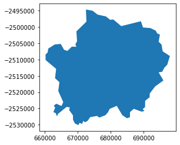
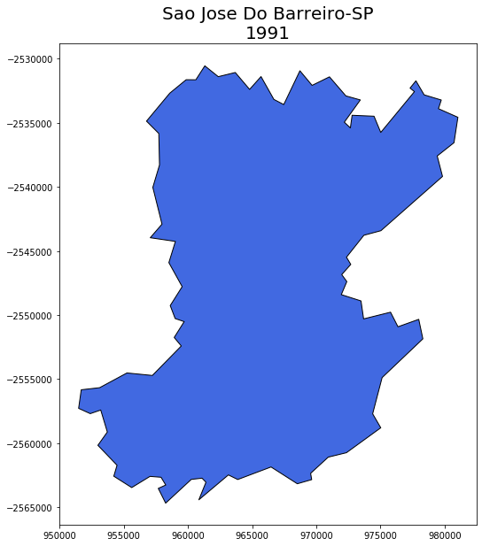

# cartpy
Um pacote em python para acessar bases cartográficas do IBGE


O cartpy é uma ferramenta para facilitar o acesso às bases cartográficas do IBGE e às estatísticas históricas dos territórios dos municípios brasileiros. Abaixo seguem instruções de instalação e uso

### 1- Instalação

O pacote está disponível no índice de pacotes do python ([PyPi](https://pypi.org/)) e, assim, pode facilmente ser instalado usando:<br>
```python
pip install cartpy
```

### 2- Uso

O cartpy possui duas classes, Year e Municipio, vamos apresentar o uso básico do pacote abordando cada classe individualmente.

#### 2.1 -Year

Essa classe serve basicamente para dar acesso direto às bases do IBGE. Assim, digamos que estejamos interessados em baixar os dados do ano de 1872, data do primeiro censo brasileiro. Para isso, basta fazer:


```python
import cartpy
```


```python
data1872=cartpy.Year(1872)
```

Com método get_geodata temos acesso à base em formato de dataframe do geopandas:


```python
sf=data1872.get_geodata()
```


```python
sf.plot()
```


    <matplotlib.axes._subplots.AxesSubplot at 0x7f3fa1c11e10>





Se o usuário estiver interessado em apenas um estado, basta especificar o código ou a sigla:


```python
data1872.get_geodata(state='BA').plot()
```


    <matplotlib.axes._subplots.AxesSubplot at 0x7f3fa0d7aa50>





```python
data1872.get_geodata(state=35).plot()
```


    <matplotlib.axes._subplots.AxesSubplot at 0x7f3fa0d1f3d0>





Também é possível ter acesso à base de municípios específicos, caso em que também é preciso especificar o estado. Novamente é possível usa o código ou o nome da unidade federativa em questão


```python
data1872.get_geodata(state='MG',county='Juiz De Fora').plot()
```


    <matplotlib.axes._subplots.AxesSubplot at 0x7f3fa0af28d0>





```python
data1872.get_geodata(state='SP',county=3526902).plot() #Limeira
```


    <matplotlib.axes._subplots.AxesSubplot at 0x7f3fa0cba690>





Qualquer das bases pode ser salva como um shapefile usando:<br>
```python
sf.to_file('filename.shp')
```

#### 2.2 - Municipio

A classe Municipio() oferece uma forma simplificada de ter acesso a diversos dados cartográficos dos municípios brasileiros em perspectiva histórica. <br>
Essa classe aceita qualquer string quando é instanciada, mas só aceitará a aplicação de seus respectivos métodos se a string usada corresponder ao município. Para evitar frustrações, é interessante usar o método search para verificar qual a ortografia da base:


```python
mun=cartpy.Municipio('Barreiro')
mun.search(year=1991)
```

    1991
    Barreiros:  ['PE']
    Sao Jose Do Barreiro:  ['SP']
    Barreira:  ['CE']
    Barreiras:  ['BA']
    Careiro:  ['AM']


Agora instanciamos novamente a classe, corrigindo a ortografia para ficar igual a base:


```python
mun=cartpy.Municipio('Sao Jose Do Barreiro')
```

Na versão atual, a classe Municipio tem os seguintes métodos:


```python
mun.get_code(state='SP',year=1991)
```


    3549607


```python
mun.all_names(code=3549607)
```

    Sao Jose Do Barreiro
    Sao Jose Dos Barreiros
    Barreiro


```python
mun.get_map(state='SP',year=1991)
```





Essa é apenas a primeira versão do pacote, outras funcionalidades serão acrescentadas ao longo do tempo por mim e/ou pela comunidade de usuários
